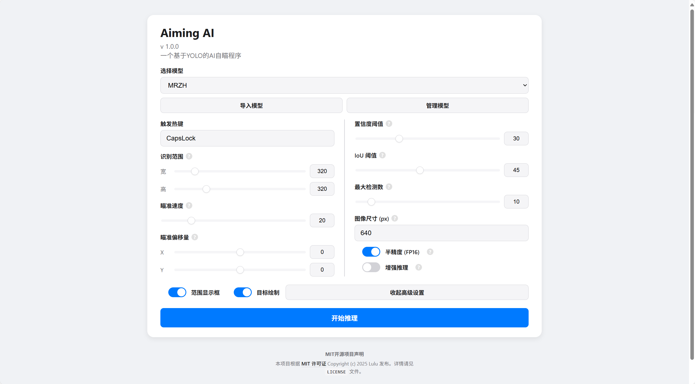

# Aiming AI - 通用AI视觉辅助框架

[](LICENSE)
[](https://www.python.org/)
[](https://pytorch.org/)
[]()

**Aiming AI** 是一个基于 [YOLOv13](https://github.com/ultralytics/ultralytics) 的通用AI视觉辅助框架，旨在为各类FPS/TPS游戏提供实时的目标检测与辅助瞄准功能。它通过直接调用驱动级的API，结合高效的推理引擎和智能跟踪算法，实现了高性能、低风险的视觉辅助。

> **郑重声明：** 本项目仅用于学习和研究计算机视觉技术（如YOLO模型、实时屏幕捕捉、底层硬件交互）在游戏领域的应用。**严禁**将此项目用于非法的商业用途或在不支持的游戏中进行恶意使用，否则由此产生的一切后果由使用者自行承担。

---

## ✨ 功能亮点

*   🖱️ **驱动级操作**：通过直接调用罗技游戏软件 (LGS) 的驱动API进行鼠标移动，绕过常规的软件事件钩子，极大降低被反作弊系统检测的风险。
*   🚀 **一键式部署**：自带嵌入式Python环境与部署脚本，无需用户手动配置复杂的Python环境或安装PyTorch等依赖，真正做到开箱即用。
*   🧩 **高度模块化**：核心推理、Web界面、配置管理完全分离。用户可以轻松替换自己的YOLO模型（`.pt`文件）来适配不同游戏。
*   🎯 **智能目标锁定**：内置基于IOU（交并比）的目标跟踪算法。在激活状态下，程序能优先持续锁定同一目标，避免在多目标场景下频繁切换，提供更稳定、更像人类的瞄准体验。
*   🖥️ **清晰的可视化界面**：提供基于Web的图形化操作界面，所有参数（如模型选择、热键、置信度、瞄准速度等）均可动态调整，直观易用。
*   ⚡ **高性能推理**：支持CUDA加速和FP16半精度推理，在兼容的NVIDIA显卡上可实现极高的帧率，确保操作的流畅性。

---

## 📸 效果演示

#### 操作界面
用户可以通过简洁的Web界面进行所有配置。



#### 模型识别效果 (以《明日之后》为例)
下图展示了框架加载特定模型后，在游戏场景中实时识别目标的检测框。


---

## 🛠️ 技术栈

*   **核心框架**: Python 3.10
*   **AI模型**: PyTorch + YOLOv13
*   **图像处理**: OpenCV, MSS (高速屏幕截图)
*   **硬件交互**: `ctypes` 调用 `logitech.driver.dll`
*   **Web界面**: Flask + Waitress (作为后端服务) + 原生HTML/CSS/JS (前端)
*   **桌面覆盖层**: PyQt6 (用于绘制检测框和状态信息)
*   **热键监听**: Pynput
*   **自动部署**: 内嵌Python环境 + Windows PowerShell/批处理脚本

---

## 🚀 快速开始 (安装与启动)

请严格按照以下步骤操作，以确保程序能正确运行。

### 第零步：系统与环境要求
*   **系统**: Windows 10/11 x64。
*   **显卡**: **推荐使用 NVIDIA RTX 系列显卡**以获得最佳性能。

### 第一步：安装罗技驱动
这是调用鼠标移动API的**核心前提**。程序运行**无需**罗技鼠标硬件，但**必须**安装此驱动。
1.  **必须安装特定版本**的罗技游戏软件 (Logitech Gaming Software): **LGS_9.02.65_x64**。
2.  下载链接：
    *   [主下载链接](https://www.123912.com/s/azIKjv-SshGA)
    *   [备用下载链接](https://www.123865.com/s/azIKjv-SshGA)
3.  安装完成后，**务必重启电脑**以确保驱动正常加载。

### 第二步：下载本项目
```bash
git clone https://github.com/sagiri0804066/Aiming-AI---AI-.git
```

### 第三步：一键部署环境
进入项目目录，找到并**双击运行 `一键部署.exe`** 程序。

该程序会自动为你完成所有环境配置，包括：
1.  解压内嵌的Python环境并安装`pip`。
2.  通过国内高速镜像源安装所有Python依赖。
3.  在桌面创建名为 `Aiming AI` 的程序快捷方式。

> **注意**: 首次运行时，由于需要下载PyTorch等较大文件，可能需要几分钟到十几分钟不等，请耐心等待直至程序执行完毕。

### 第四步：启动程序
部署完成后，直接**双击桌面上生成的 `Aiming AI` 快捷方式**即可启动程序。程序启动后会自动在你的默认浏览器中打开操作界面。

---

## 📖 使用说明

1.  **选择模型**: 在界面的`选择模型`下拉框中，选择你想要使用的YOLO模型（`.pt`文件）。
2.  **设置热键**: 在`触发热键`输入框中设置一个你喜欢的按键来激活/暂停AI（如`CapsLock`、`Alt`等）。
3.  **调整参数**:
    *   **识别范围**: 拖动滑块调整AI在屏幕中心识别的区域大小。
    *   **瞄准速度**: 控制鼠标跟随目标的平滑度/速度。
    *   **置信度阈值**: 只有当模型识别目标的信心大于此值时，才会被视为有效目标。
    *   **IoU阈值**: 用于目标去重，值越小去重越严格。
    *   **其他开关**: 按需开启范围显示、目标绘制等。
4.  **开始运行**: 点击蓝色的 **`开始推理`** 按钮。
5.  **激活/暂停**: 按下你设置的`触发热键`，即可在游戏中随时开启或关闭AI辅助功能。

---

## ⚙️ 工作原理

程序启动后，会同时运行一个本地Web服务器（用于设置界面）和一个桌面覆盖层应用（用于绘制）。当用户点击“开始推理”后，主程序会启动一个独立的推理线程，其工作流程如下：

1.  **屏幕捕捉**：使用`mss`库高速截取屏幕中心指定范围的图像。
2.  **模型推理**：将捕获的图像传递给加载的YOLOv13模型，模型在GPU上进行计算，返回识别到的所有目标的边界框坐标。
3.  **目标决策**：根据内置的IOU跟踪算法，从所有目标中选出最佳锁定目标。
4.  **鼠标控制**：计算出目标位置与屏幕准心的像素偏差，然后通过`ctypes`直接调用`logitech.driver.dll`提供的API函数，发送鼠标移动指令。
5.  **信息绘制**：将识别框、运行状态等信息发送到桌面覆盖层，由PyQt6实时绘制在屏幕顶层，为用户提供可视化反馈。

---

## 📜 许可证 (License)

本项⽬根据 [MIT许可证](LICENSE) 授权。详情请参阅 `LICENSE` ⽂件。